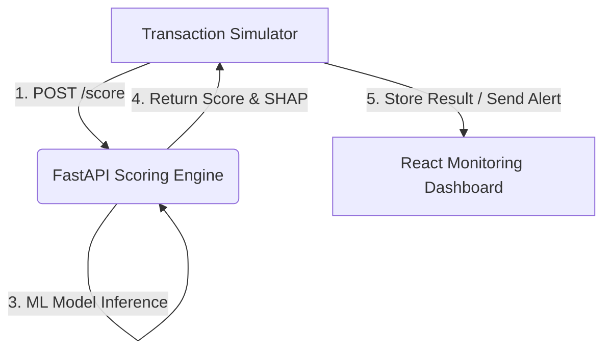

# 🔒 PaymentMate AI: Real-Time Fraud Detection System

**A production-ready solution leveraging real-time Machine Learning and a decoupled architecture to score financial transactions for fraud with high precision and low latency.**

PaymentMate AI addresses the core challenge in FinTech: achieving sub-100ms fraud detection while maintaining a low false-positive rate. This project demonstrates expertise in financial domain challenges, MLOps, and real-time system design.

## 🚀 Key Features

* **Low-Latency Scoring:** **FastAPI** microservice designed to score transactions in **under 100 milliseconds**, enabling real-time decision-making.
* **Behavioral Feature Engineering:** Model relies on crucial real-time **velocity features** (e.g., transactions-per-minute, rolling spend averages) which are highly predictive of anomalous behavior.
* **Explainable AI (XAI):** Uses **SHAP** to generate on-demand explanations for every flagged transaction, giving analysts trust and insight into the model's decision-making process.
* **Decoupled Architecture:** Built on a robust, scalable pattern: **FastAPI (Backend) + React (Frontend)**.
* **Performance Monitoring:** The React dashboard monitors key business metrics like **Precision** and **Recall**, critical for balancing fraud prevention against customer experience (false declines).

## 🛠️ Technology Stack

| Component | Technology | Role in PaymentMate AI |
| :--- | :--- | :--- |
| **Backend (Inference)** | **FastAPI, Python** | Low-latency API for transaction scoring and real-time feature calculation. |
| **ML Models** | **XGBoost / Isolation Forest** | Classification and Anomaly Detection for high-precision fraud identification. |
| **XAI** | **SHAP** | Integration for transaction-level explainability. |
| **Frontend (Dashboard)**| **React, JavaScript** | Real-time monitoring UI for alerts and performance metrics. |
| **MLOps/Infra** | **Docker** | Containerization of the scoring engine for reliable, scalable deployment. |

## 📐 Decoupled Architecture Diagram

The system simulates a mission-critical flow, where the ML service runs as a core gatekeeper.

