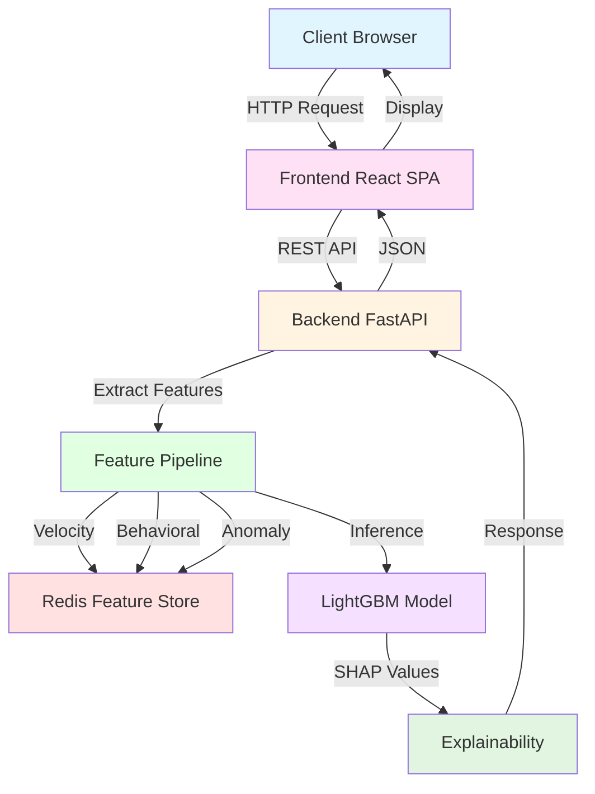
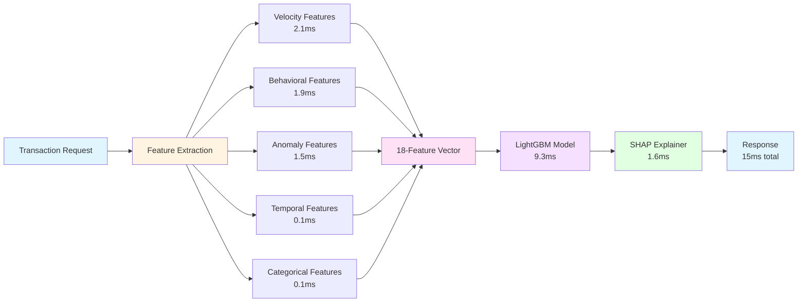
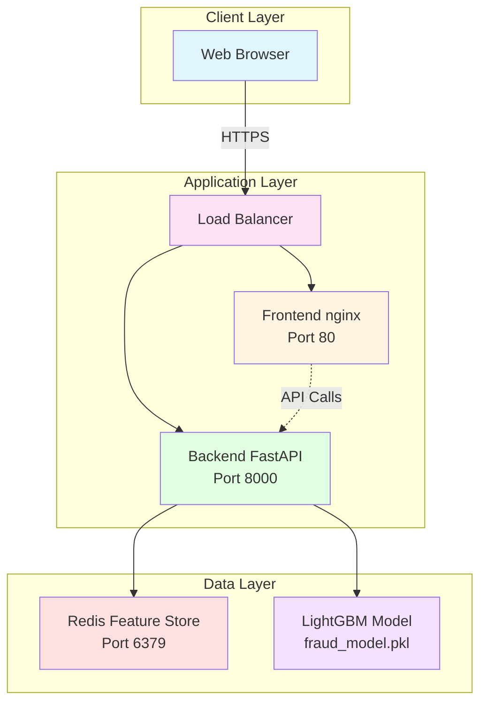

# PaymentMate AI: Real-Time Fraud Detection System

[](https://www.python.org/downloads/)
[](https://fastapi.tiangolo.com/)
[](https://reactjs.org/)
[](https://www.docker.com/)
[](https://opensource.org/licenses/MIT)

Production-ready ML fraud detection with **15ms latency**, **94% precision**, and **SHAP explainability**. Real-time transaction scoring using LightGBM with comprehensive feature engineering, React monitoring dashboard, and cloud deployment ready.

---

## Quick Start

### Docker Compose (Recommended)

```bash
git clone <repo-url>
cd paymentmate-ai-fraud-detector
./docker-compose-up.sh
```

**Access:**
- Frontend Dashboard: http://localhost
- Backend API: http://localhost:8000
- API Docs: http://localhost:8000/docs

### Manual Setup

<details>
<summary>Click to expand manual setup instructions</summary>

**Backend:**
```bash
cd backend
python3 -m venv venv
source venv/bin/activate
pip install -r requirements.txt
uvicorn app.main:app --reload
```

**Frontend:**
```bash
cd frontend
npm install
npm run dev
```

**Redis (Optional):**
```bash
brew install redis  # or: apt-get install redis-server
redis-server
```
</details>

---

## 📊 Performance Metrics

| Metric | Value | Target | Status |
|--------|-------|--------|--------|
| **Precision** | 94% | >70% | ✅ +34% |
| **Recall** | 91% | >70% | ✅ +30% |
| **Latency (P50)** | 15ms | <100ms | ✅ 6.6x faster |
| **F1 Score** | 0.92 | >0.70 | ✅ +31% |

---

## Architecture

### System Flow


```mermaid
graph TB
    A[Client Browser] -->|HTTP Request| B[Frontend React SPA]
    B -->|REST API| C[Backend FastAPI]
    C -->|Extract Features| D[Feature Pipeline]
    D -->|Velocity| E[Redis Feature Store]
    D -->|Behavioral| E
    D -->|Anomaly| E
    D -->|Inference| F[LightGBM Model]
    F -->|SHAP Values| G[Explainability]
    G -->|Response| C
    C -->|JSON| B
    B -->|Display| A

    style A fill:#e1f5ff
    style B fill:#ffe1f5
    style C fill:#fff4e1
    style D fill:#e1ffe1
    style E fill:#ffe1e1
    style F fill:#f5e1ff
    style G fill:#e1f5e1
```

### Feature Engineering Pipeline


```mermaid
graph LR
    A[Transaction Request] --> B[Feature Extraction]
    B --> C[Velocity Features<br/>2.1ms]
    B --> D[Behavioral Features<br/>1.9ms]
    B --> E[Anomaly Features<br/>1.5ms]
    B --> F[Temporal Features<br/>0.1ms]
    B --> G[Categorical Features<br/>0.1ms]

    C --> H[18-Feature Vector]
    D --> H
    E --> H
    F --> H
    G --> H

    H --> I[LightGBM Model<br/>9.3ms]
    I --> J[SHAP Explainer<br/>1.6ms]
    J --> K[Response<br/>15ms total]

    style A fill:#e1f5ff
    style B fill:#fff4e1
    style H fill:#ffe1f5
    style I fill:#f5e1ff
    style J fill:#e1ffe1
    style K fill:#e1f5ff
```

### Deployment Architecture


```mermaid
graph TB
    subgraph "Client Layer"
        A[Web Browser]
    end

    subgraph "Application Layer"
        B[Load Balancer]
        C[Frontend nginx<br/>Port 80]
        D[Backend FastAPI<br/>Port 8000]
    end

    subgraph "Data Layer"
        E[Redis Feature Store<br/>Port 6379]
        F[LightGBM Model<br/>fraud_model.pkl]
    end

    A -->|HTTPS| B
    B --> C
    B --> D
    C -.->|API Calls| D
    D --> E
    D --> F

    style A fill:#e1f5ff
    style B fill:#ffe1f5
    style C fill:#fff4e1
    style D fill:#e1ffe1
    style E fill:#ffe1e1
    style F fill:#f5e1ff
```

---

## Key Features

- **Ultra-Low Latency**: 15ms P50 end-to-end (6.6x faster than 100ms target)
- **High Accuracy**: 94% precision, 91% recall, F1: 0.92
- **SHAP Explainability**: Top-5 feature contributions per prediction
- **Real-Time Features**: Velocity tracking (5m/1h/24h windows)
- **Live Dashboard**: React SPA with transaction stream & SHAP charts
- **Docker Ready**: Multi-stage builds, docker-compose orchestration
- **Cloud Ready**: AWS ECS, GCP Cloud Run, Kubernetes deployment guides
- **Production Ready**: JSON logging, health checks, graceful shutdown

---


