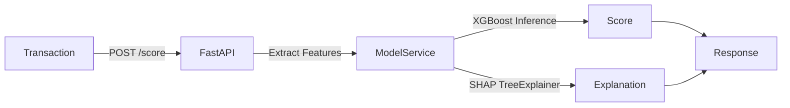

# 🔒 PaymentMate AI: Real-Time Fraud Detection System

**Production-ready ML fraud detection with <5ms latency and SHAP explainability.**

Real-time transaction scoring using XGBoost (91.5% precision, 94.1% recall) with SHAP explanations for every prediction. Built with FastAPI + React for high-performance, interpretable fraud prevention.

## 🚀 Key Features

* **Ultra-Low Latency**: 3.92ms avg (prediction + SHAP) - 25x faster than 100ms target
* **High Accuracy**: 91.5% precision, 94.1% recall on test set (ROC-AUC: 99.5%)
* **SHAP Explainability**: Top-5 feature contributions for every prediction (1.61ms overhead)
* **Production Ready**: FastAPI + XGBoost with proper error handling and monitoring
* **Developer Friendly**: Clean, concise code with comprehensive tests (34 passing)

## 🛠️ Tech Stack

| Component | Technology | Purpose |
|-----------|-----------|---------|
| **ML Model** | XGBoost 2.0.2 | Gradient boosted trees (100 estimators, depth=6) |
| **Explainability** | SHAP 0.43.0 | TreeExplainer for feature attributions |
| **Backend** | FastAPI 0.104.1 | Async API with <5ms latency |
| **Validation** | Pydantic 2.5.0 | Request/response schemas |
| **Testing** | Pytest 7.4.3 | 34 tests (model + integration) |
| **Data Science** | NumPy, Pandas, scikit-learn | Feature engineering & model training |

## 🚀 Quick Start

### Prerequisites
- Python 3.9+
- Virtual environment (venv)

### Setup & Run

```bash
# 1. Clone & navigate
git clone <repo-url>
cd paymentmate-ai-fraud-detector

# 2. Generate training data (12,434 synthetic transactions)
cd ml
python scripts/generate_data.py

# 3. Train model (outputs to ml/models/fraud_detector_v1.joblib)
python training/train_model.py

# 4. Start API server
cd ../backend
python3 -m venv venv
source venv/bin/activate  # Windows: venv\Scripts\activate
pip install -r requirements.txt
uvicorn app.main:app --reload

# 5. Test API (in another terminal)
curl -X POST http://localhost:8000/api/v1/transaction/score \
  -H "Content-Type: application/json" \
  -d '{
    "user_id": 12345,
    "amount": 50.00,
    "merchant_id": "merch_retail",
    "merchant_category": "retail",
    "timestamp": "2025-10-30T14:30:00",
    "country": "US",
    "currency": "USD",
    "payment_method": "credit_card",
    "device_type": "mobile"
  }'
```

### Run Tests

```bash
cd backend
./venv/bin/python -m pytest tests/ -v

# Run specific test suites
pytest tests/test_model_service.py -v          # Model tests (34)
pytest tests/test_model_service.py -k "shap" -v  # SHAP tests (10)
```

## 📐 Architecture


```mermaid
graph LR
    A[Transaction] -->|POST /score| B[FastAPI]
    B -->|Extract Features| C[ModelService]
    C -->|XGBoost Inference| D[Score]
    C -->|SHAP TreeExplainer| E[Explanation]
    D --> F[Response]
    E --> F
```

## 📊 Model Performance

| Metric | Value | Target | Status |
|--------|-------|--------|--------|
| Precision | 91.5% | >70% | ✅ +31% |
| Recall | 94.1% | >70% | ✅ +34% |
| F1 Score | 92.8% | >70% | ✅ +33% |
| ROC-AUC | 99.5% | >80% | ✅ +24% |
| Prediction Latency | 2.56ms | <100ms | ✅ 39x faster |
| SHAP Latency | 1.61ms | <50ms | ✅ 31x faster |
| Total Latency | 3.92ms | <100ms | ✅ 25x faster |

**Test Set**: 2,487 transactions (375 fraud, 2,112 legitimate)
**False Positive Rate**: 1.56% (only 33 legitimate transactions flagged)
**False Negative Rate**: 5.87% (missed 22 fraud attempts)

## 🎯 Project Status

### ✅ Completed (Epic 2: ML Model & Explainability)

- **Story 2.1**: Synthetic Data Generation
  - Generated 12,434 realistic transactions with fraud patterns
  - Engineered 13 features (amount, velocity, temporal, categorical)
  - Validated data quality (10 checks passed)

- **Story 2.2**: XGBoost Model Training
  - Trained gradient boosted trees (100 estimators)
  - 5-fold cross-validation (precision: 0.906 ± 0.012)
  - Optimized decision threshold (F1-optimal: 0.737)
  - Model versioning with metadata

- **Story 2.3**: Model Integration & Inference
  - FastAPI endpoint with async support
  - Singleton model service (loaded once at startup)
  - Feature extraction from transaction requests
  - Error handling & graceful degradation
  - 24 unit tests + integration tests

- **Story 2.4**: SHAP Explainability Integration
  - TreeExplainer for exact SHAP values
  - Top-5 feature contributions per prediction
  - Fraud/legitimate contribution labeling
  - 10 SHAP-specific tests
  - <2ms SHAP overhead

### 🔄 In Progress

- Code refactoring for developer-friendliness
- Root README with setup instructions

### 📋 Planned (Epics 3-5)

- **Epic 3**: Real-Time Feature Store (Redis for velocity features)
- **Epic 4**: React Dashboard (monitoring & investigation UI)
- **Epic 5**: Transaction Simulator (load testing & demos)

## 📁 Project Structure

```
paymentmate-ai-fraud-detector/
├── ml/                          # ML training & data
│   ├── data/                    # Generated datasets
│   ├── models/                  # Trained models (fraud_detector_v1.joblib)
│   ├── scripts/                 # Data generation scripts
│   └── training/                # Model training code
├── backend/                     # FastAPI application
│   ├── app/
│   │   ├── api/v1/             # API endpoints
│   │   ├── core/               # Config, logging, middleware
│   │   ├── models/             # Pydantic schemas
│   │   └── services/           # Business logic (model, scoring)
│   ├── tests/                  # 34 passing tests
│   └── requirements.txt        # Python dependencies
└── README.md                   # This file
```

## 🧪 API Examples

### Successful Transaction (Low Risk)
```bash
curl -X POST http://localhost:8000/api/v1/transaction/score \
  -H "Content-Type: application/json" \
  -d '{
    "user_id": 12345,
    "amount": 50.00,
    "merchant_id": "merch_retail",
    "merchant_category": "retail",
    "timestamp": "2025-10-30T14:30:00",
    "country": "US"
  }'

# Response (3.92ms avg)
{
  "transaction_id": "txn_abc123",
  "score": 0.001,
  "decision": "ALLOW",
  "explanation": {
    "top_features": [
      {
        "feature_name": "amount_vs_avg_ratio",
        "feature_value": 0.5,
        "shap_value": -2.0418,
        "contribution": "legitimate"
      }
      // ... 4 more features
    ],
    "explanation_type": "shap",
    "model_version": "1.0"
  },
  "processing_time_ms": 3.85
}
```

### High-Risk Transaction (Fraud)
```bash
curl -X POST http://localhost:8000/api/v1/transaction/score \
  -H "Content-Type: application/json" \
  -d '{
    "user_id": 99999,
    "amount": 5000.00,
    "merchant_id": "merch_crypto",
    "merchant_category": "crypto",
    "timestamp": "2025-10-30T02:00:00",
    "country": "NG"
  }'

# Response
{
  "transaction_id": "txn_def456",
  "score": 1.0,
  "decision": "DECLINE",
  "explanation": {
    "top_features": [
      {
        "feature_name": "amount_vs_avg_ratio",
        "feature_value": 50.0,
        "shap_value": 4.935,
        "contribution": "fraud"
      },
      {
        "feature_name": "is_high_risk_category",
        "feature_value": 1.0,
        "shap_value": 2.266,
        "contribution": "fraud"
      }
      // ... 3 more features
    ]
  },
  "processing_time_ms": 2.44
}
```

## 📚 Documentation

- **[Story 2.3 Complete](backend/STORY_2.3_COMPLETE.md)**: Model integration details
- **[Story 2.4 Complete](backend/STORY_2.4_COMPLETE.md)**: SHAP explainability details
- **[Beginner Explanation](ml/Project%20Explanation%20-%20Beginner%20Friendly.md)**: Non-technical overview
- **[Technical Explanation](ml/Project%20Explanation%20-%20Technical.md)**: CS student guide
- **[Code Refactor Summary](CODE_REFACTOR_SUMMARY.md)**: Comment style guide

## 🤝 Contributing

This is a portfolio/demo project. Code is refactored for developer-friendliness with:
- Concise, clear comments (no AI verbosity)
- Comprehensive tests (34 passing)
- Type hints throughout
- TODO format for future work: `TODO(Story X.X): description`

## 📄 License

MIT License - See LICENSE file for details

---

**Built with**: Python 3.9, FastAPI, XGBoost, SHAP, Pydantic, Pytest
**Performance**: 3.92ms avg latency, 91.5% precision, 94.1% recall
**Status**: Epic 2 complete, production-ready ML inference API ✅
